# **🍰 Website Pemesanan Kue Online** 🎂

**Platform Pemesanan Kue yang Mudah dan Cepat!**  
Nikmati pengalaman memesan berbagai jenis kue dengan antarmuka yang ramah pengguna dan sistem pengelolaan yang efisien. Website ini memiliki fitur lengkap untuk pelanggan dan admin, memberikan kemudahan dalam bertransaksi dan pengelolaan pesanan.

---

## **✨ Fitur Utama**

### 1. **Pemesanan Kue** 🛒
- **Telusuri Beragam Kue**: Jelajahi katalog kue dengan tampilan gambar yang menarik, deskripsi detail, dan harga transparan.
- **Pilih dan Sesuaikan**: Pilih jumlah dan jenis kue yang diinginkan dengan antarmuka yang intuitif dan mudah digunakan.

### 2. **Proses Checkout dan Pembayaran** 💳
- **Masukkan Detail Pengiriman**: Isi informasi alamat pengiriman dan nomor telepon untuk memudahkan pengiriman.
- **Metode Pembayaran yang Beragam**: Nikmati kemudahan bertransaksi melalui transfer bank, serta integrasi aplikasi pembayaran populer.
- **Tinjau Pesanan**: Pastikan semua informasi sudah benar sebelum menyelesaikan pembayaran.

### 3. **Panel Admin** 👨‍💻
- **Manajemen Produk**: Mudah untuk menambah, mengedit, atau menghapus produk dari katalog kue.
- **Pemantauan Pesanan**: Cek status pesanan, pengiriman, dan pembayaran dengan mudah.
- **Riwayat dan Statistik**: Lihat laporan lengkap dan data statistik mengenai pemesanan untuk pengelolaan yang lebih baik.

---

## **🛠 Teknologi yang Digunakan**

### **Frontend (User):**
- **Tailwind CSS**: Framework CSS untuk desain web responsif yang modern dan estetis.
- **Ajax**: Interaksi lebih cepat tanpa perlu memuat ulang halaman.
- **AOS JS & Swiper JS**: Menambahkan animasi halus dan slider dinamis untuk pengalaman pengguna yang lebih interaktif.

### **Backend (Admin):**
- **Tailwind CSS**: Desain konsisten dan sederhana untuk panel admin.
- **AOS JS & Delivr JS**: Efisiensi animasi dan pengelolaan modul untuk pengalaman admin yang lebih nyaman.
- **Midtrans API**: Solusi pembayaran yang aman dan cepat, mendukung berbagai metode pembayaran.

---

## **📦 Instalasi**

### **Persyaratan Sistem**
- **PHP**: Versi 7.4 atau lebih tinggi.
- **Database**: MySQL atau sistem database yang kompatibel.
- **Server Lokal**: XAMPP atau software sejenis (opsional untuk pengembangan).
- **Composer**: Untuk manajemen dependensi dan pengelolaan paket.

---

## **📸 Dokumentasi Gambar**

### **Tampilan Pengguna**
- **Dashboard Pengguna**:  
  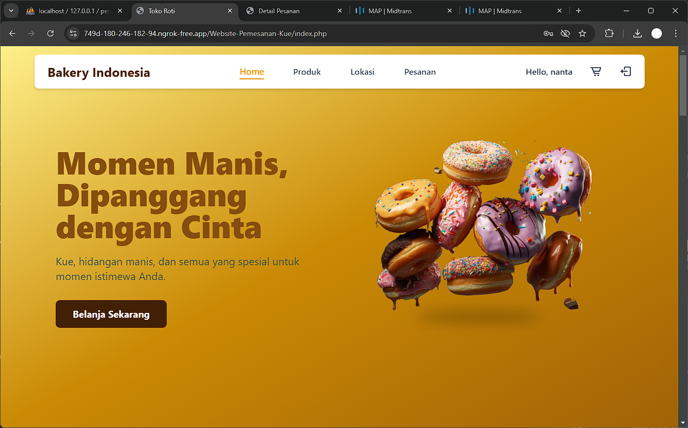
- **Keranjang Belanja**:  
  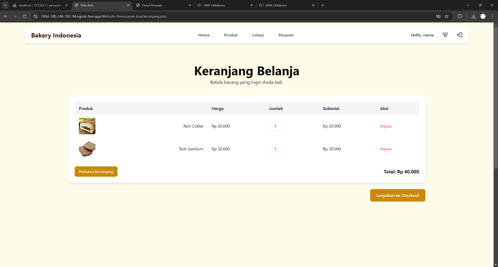
- **Proses Checkout**:  
  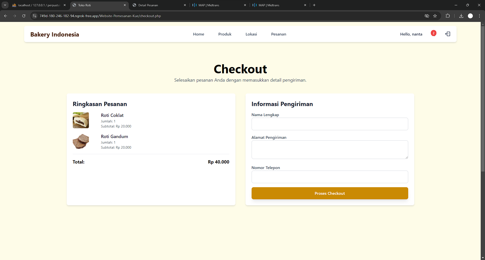
- **Integrasi Midtrans**:  
  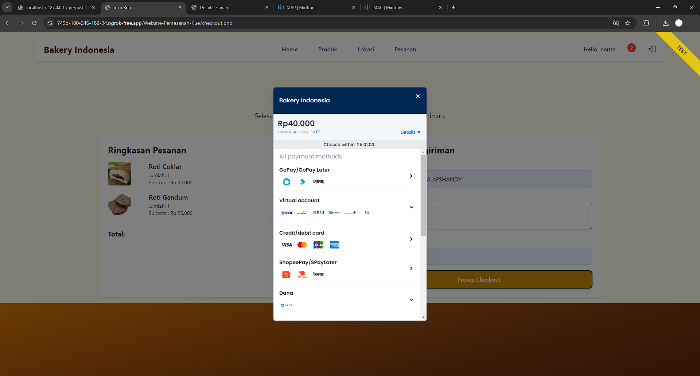
- **Detail Pesanan**:  
  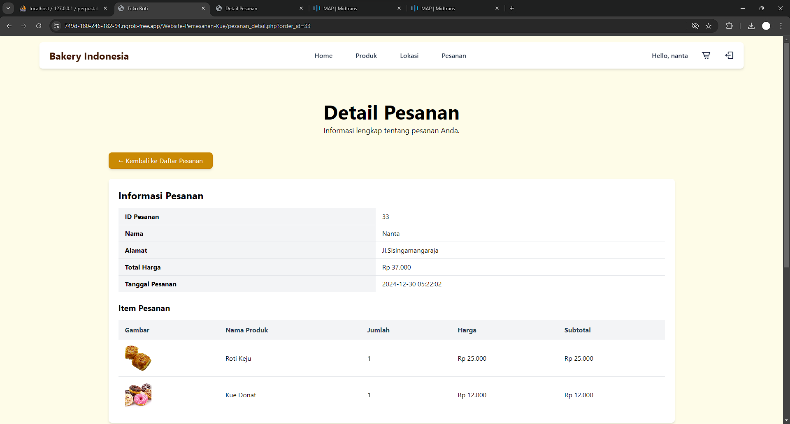
- **Status Pesanan**:  
  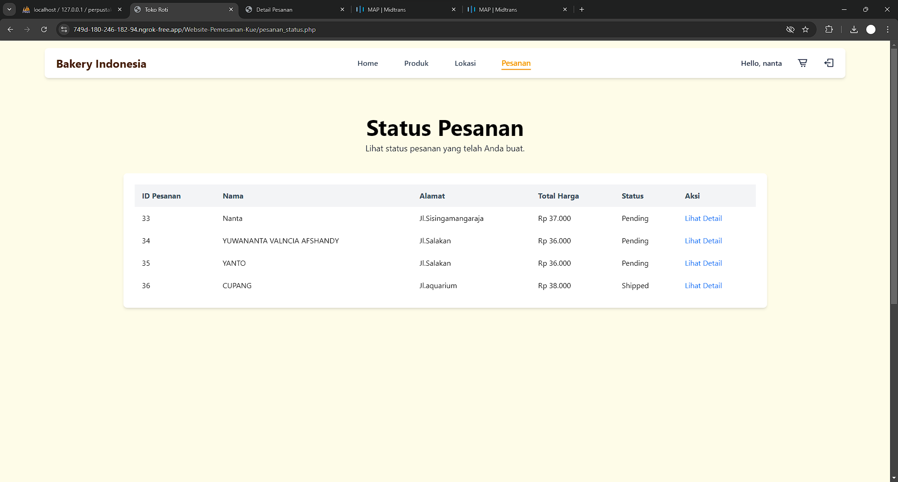
- **Lokasi Pengiriman**:  
  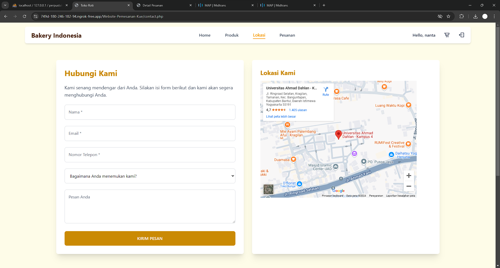
- **Detail Produk**:  
  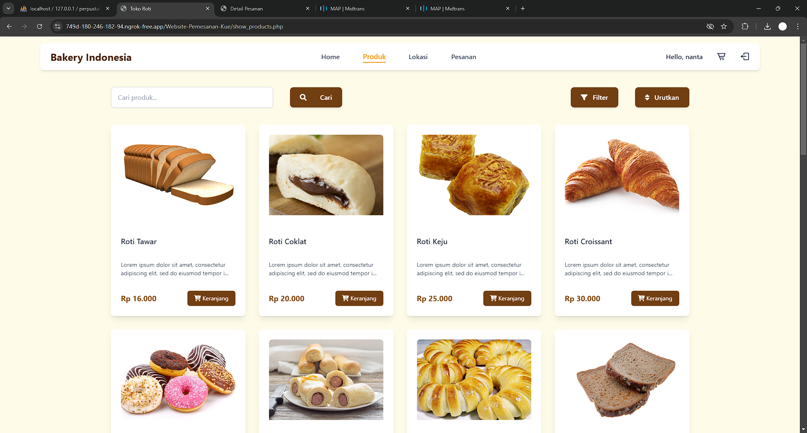

### **Tampilan Admin**
- **Halaman Login Admin**:  
  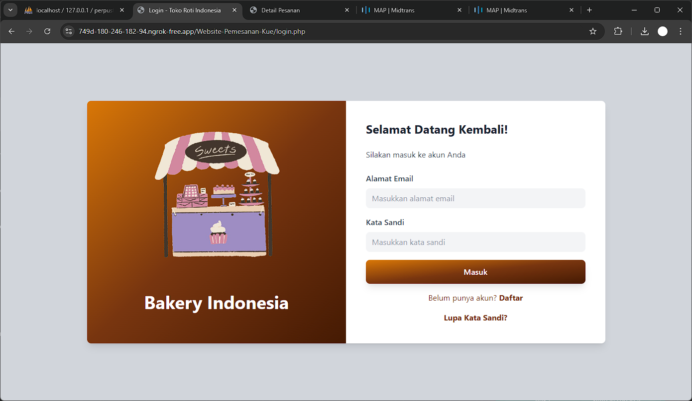
- **Statistik Pemesanan**:  
  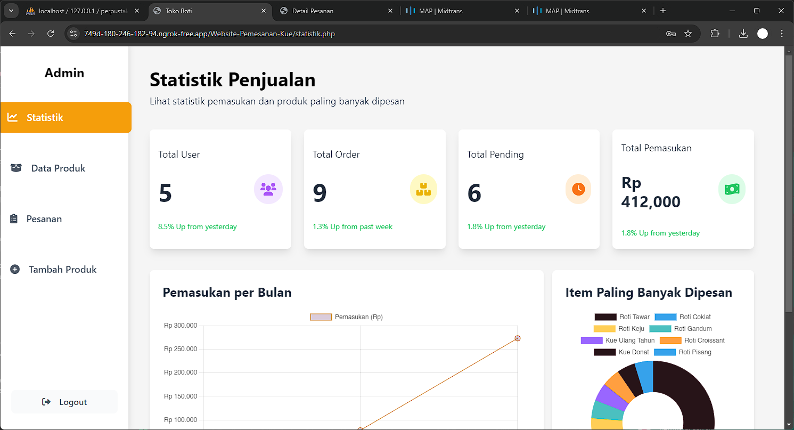
- **Tambah Pesanan**:  
  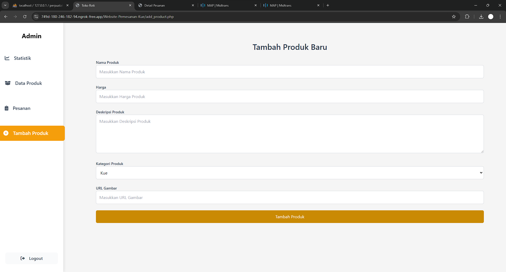
- **Detail Pesanan Admin**:  
  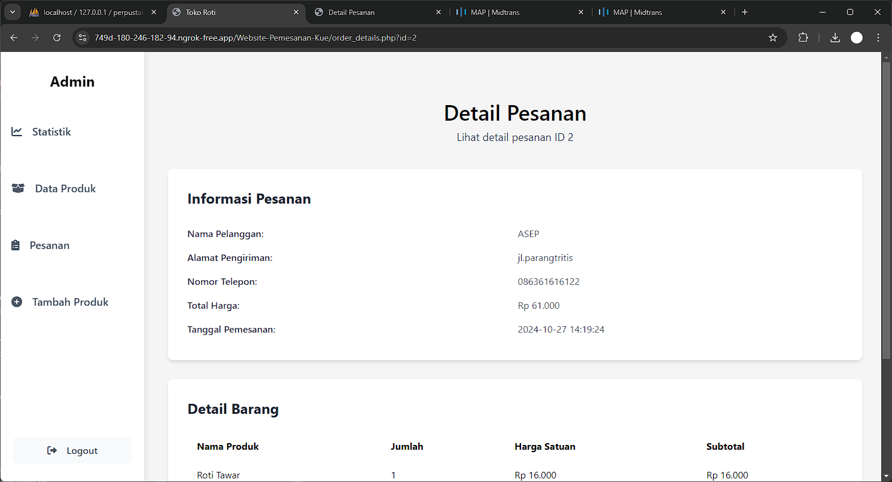
- **Daftar Pesanan Admin**:  
  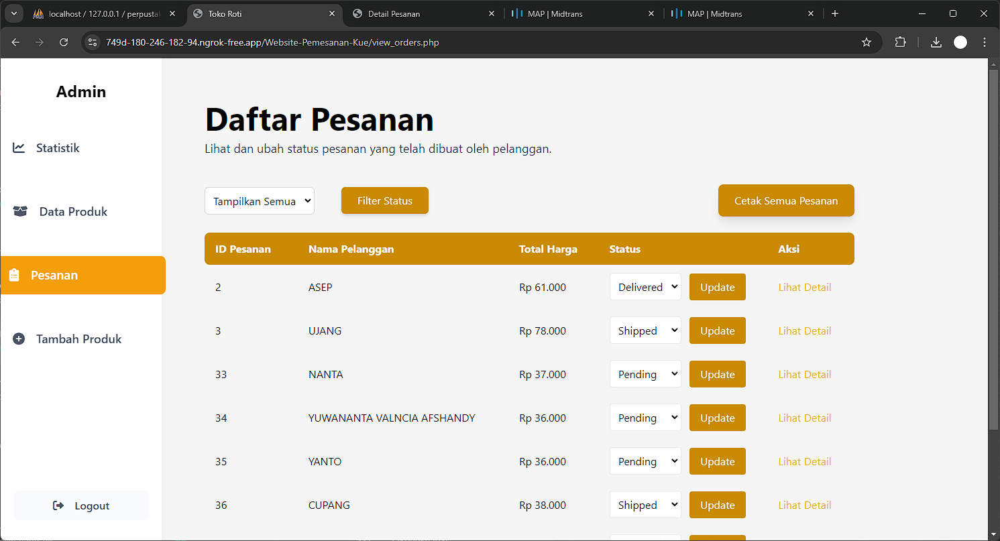

**Nikmati kemudahan dan kenyamanan dalam memesan kue melalui Website Pemesanan Kue Online!** 🎂
